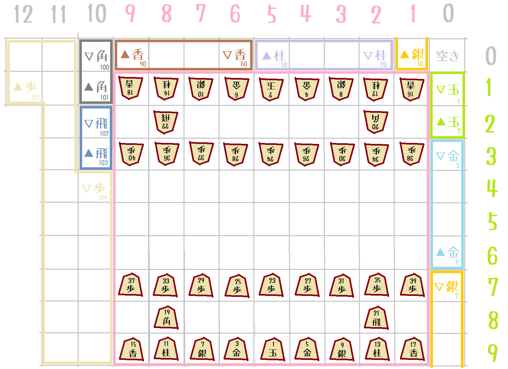

# kifuwarabe-shogi-entry-model

This program is entry model for computer shogi.  
However, Kifuwarabe is not a common implementation.  

## Special implementation notes



The captured pieces are arranged on the outside of the board.  
This is an uncommon implementation.  

Enter the following command in the game:  

```plain
position startpos
pos2
[0 ply.  ▲ phase. 0 repeats.]

  12   11   10    9    8    7    6    5    4    3    2    1    0
+----+----+----+----+----+----+----+----+----+----+----+----+----+
|         |    |                   |                   |    |    | z
+    +    +    +----+----+----+----+----+----+----+----+----+----+
|         |    |15L |11N |07S |03G |02K |04G |08S |12N |16L |    | a
+----+    +----+----+----+----+----+----+----+----+----+----+    +
     |    |    |    |21R |    |    |    |    |    |19B |    |    | b
     +    +    +----+----+----+----+----+----+----+----+----+----+
     |    |    |23P |24P |25P |26P |27P |28P |29P |30P |31P |    | c
     +    +----+----+----+----+----+----+----+----+----+----+    +
     |         |    |    |    |    |    |    |    |    |    |    | d
     +    +    +----+----+----+----+----+----+----+----+----+    +
     |         |    |    |    |    |    |    |    |    |    |    | e
     +    +    +----+----+----+----+----+----+----+----+----+    +
     |         |    |    |    |    |    |    |    |    |    |    | f
     +    +    +----+----+----+----+----+----+----+----+----+----+
     |         |32P |33P |34P |35P |36P |37P |38P |39P |40P |    | g
     +    +    +----+----+----+----+----+----+----+----+----+    +
     |         |    |20B |    |    |    |    |    |22R |    |    | h
     +    +    +----+----+----+----+----+----+----+----+----+    +
     |         |17L |13N |09S |05G |01K |06G |10S |14N |18L |    | i
     +----+----+----+----+----+----+----+----+----+----+----+----+
 01K  02K  03G  04G  05G  06G  07S  08S  09S  10S  11N  12N  13N  14N  15L  16L  17L  18L  19B  20B
+----+----+----+----+----+----+----+----+----+----+----+----+----+----+----+----+----+----+----+----+
|  5i|  5a|  6a|  4a|  6i|  4i|  7a|  3a|  7i|  3i|  8a|  2a|  8i|  2i|  9a|  1a|  9i|  1i|  2b|  8h|
| ▲K | ▽k | ▽g | ▽g | ▲G | ▲G | ▽s | ▽s | ▲S | ▲S | ▽n | ▽n | ▲N | ▲N | ▽l | ▽l | ▲L | ▲L | ▽b | ▲B |
+----+----+----+----+----+----+----+----+----+----+----+----+----+----+----+----+----+----+----+----+
 21R  22R  23P  24P  25P  26P  27P  28P  29P  30P  31P  32P  33P  34P  35P  36P  37P  38P  39P  40P
+----+----+----+----+----+----+----+----+----+----+----+----+----+----+----+----+----+----+----+----+
|  8b|  2h|  9c|  8c|  7c|  6c|  5c|  4c|  3c|  2c|  1c|  9g|  8g|  7g|  6g|  5g|  4g|  3g|  2g|  1g|
| ▽r | ▲R | ▽p | ▽p | ▽p | ▽p | ▽p | ▽p | ▽p | ▽p | ▽p | ▲P | ▲P | ▲P | ▲P | ▲P | ▲P | ▲P | ▲P | ▲P |
+----+----+----+----+----+----+----+----+----+----+----+----+----+----+----+----+----+----+----+----+
```

## Bug

駒を取るときに不具合。

### Case.1 中断

↓ 途中図からやっても、不具合が出ない。

```plain
usi
isready
setoption name USI_Ponder value true
setoption name USI_Hash value 256
setoption name MaxPly value 320
setoption name DepthNotToGiveUp value 4
setoption name MaxDepth value 7
setoption name MinThinkMsec value 5000
setoption name MaxThinkMsec value 17000
position startpos moves 9g9f 3c3d 5i4h 4a3b 4h5h 3a4b 5h6h 4b3c 7g7f 6a5b 6h7h 1c1d 7h6h 5a4b 6h5i 3d3e 5i4h 4c4d 4h5h 5b4c 5h6h 1d1e 6h7h 4d4e 7h6h 6c6d 8h5e 6d6e 6h7h 2c2d 7h8h 2d2e 8h9h 8c8d 9h8h 8d8e 8h9h 8e8f 8g8f 8b8f 7f7e 9c9d 6i6h P*8g 9h9g 8f8e 8i7g 8e8c 7g6e 4c5d 5e7g 5d6e P*8f 6e7f
go btime 165000 wtime 408000 binc 5000 winc 5000
```

↓ ハッシュで落ちる？

```plain
position startpos moves 9g9f 3c3d 5i4h 4a3b 4h5h 3a4b 5h6h 4b3c 7g7f 6a5b 6h7h 1c1d 7h6h 5a4b 6h5i 3d3e 5i4h 4c4d 4h5h 5b4c 5h6h 1d1e 6h7h 4d4e 7h6h 6c6d 8h5e 6d6e 6h7h 2c2d 7h8h 2d2e 8h9h 8c8d 9h8h 8d8e 8h9h 8e8f 8g8f 8b8f 7f7e 9c9d 6i6h P*8g 9h9g 8f8e 8i7g 8e8c 7g6e 4c5d 5e7g 5d6e P*8f 6e7f 7g5e N*6c
```

↓ 駒を取る直前:  

```plain
xfen lnsgkgsnl/1r5b1/p1ppppppp/7P1/1p7/9/PPPPPPP1P/1B5R1/LNSGKGSNL w 6 moves 2g2f 8c8d 2f2e 8d8e 2e2d
xfen lnsgkgsnl/1r5b1/p1pppp2p/6R2/1p7/9/PPPPPPP1P/1B7/LNSGKGSNL w 10 moves 2g2f 8c8d 2f2e 8d8e 2e2d 2c2d 2h2d 3c3d 2d3d
```
